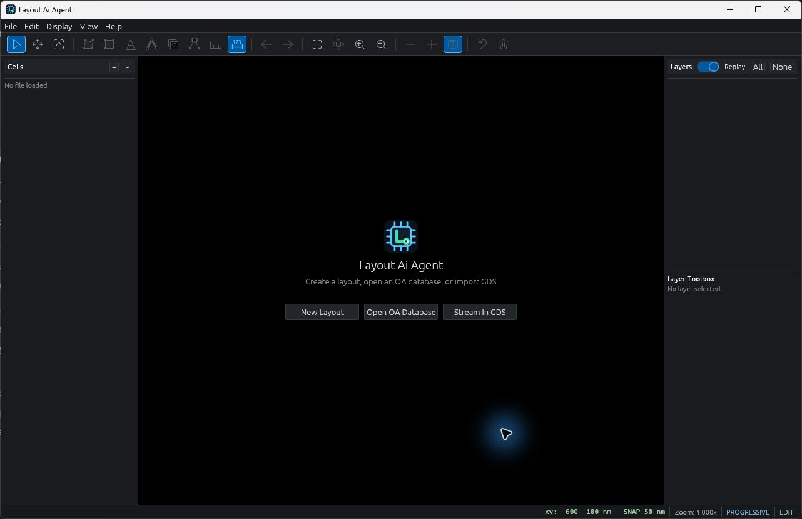
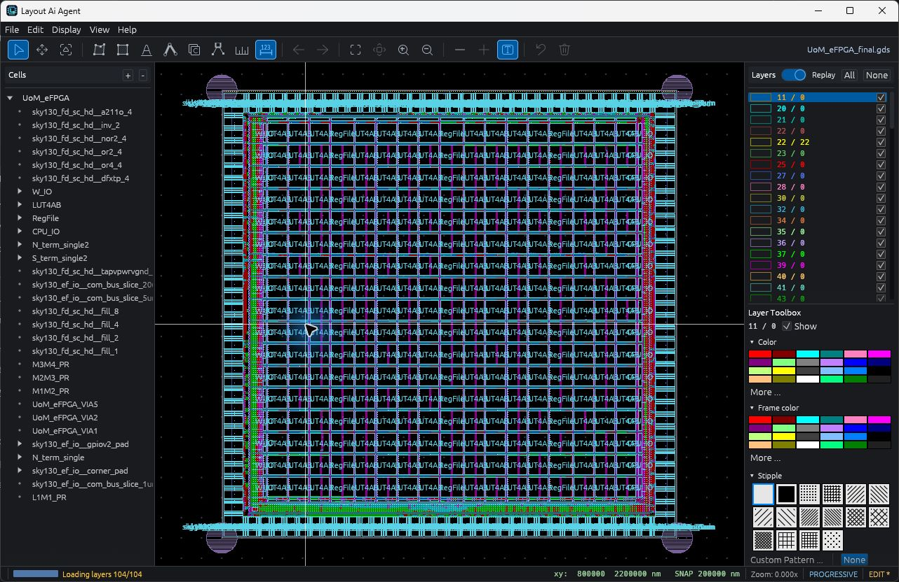
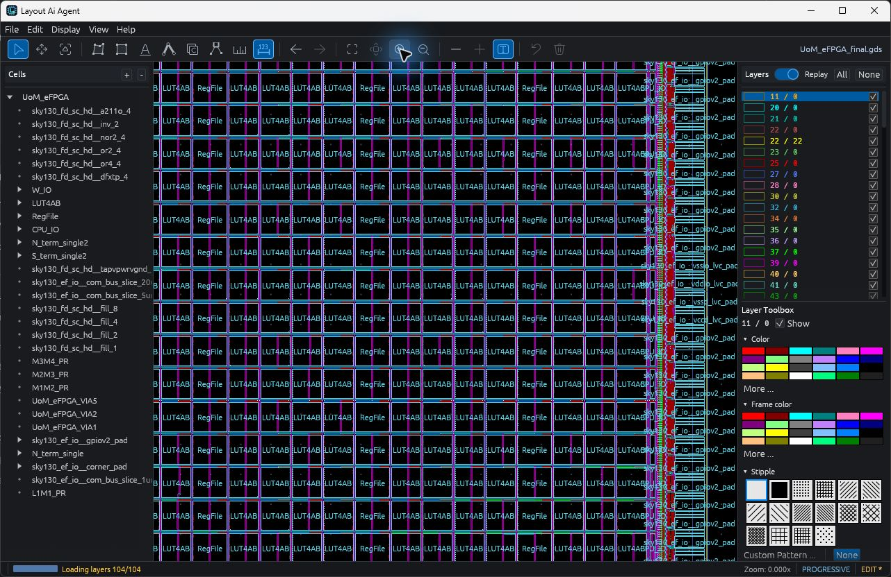

# Layout AI Agent — Public Releases

## Download for Windows

[**Download Layout AI Agent 0.1.0 Early Access**](https://github.com/synerraise/Layout-editor-viewer/releases/download/v0.1.0/lagent_0.1.0_x64-setup.exe)

- Platform: Windows x86-64
- Status: Early Access pre-release
- Installer: unsigned; Windows SmartScreen may display a warning
- [Release notes, checksum, and all assets](https://github.com/synerraise/Layout-editor-viewer/releases/tag/v0.1.0)

Verify the downloaded installer before running it. Its SHA-256 value is:

```text
C0C37AB178A51B0770289C317958A2C20523DC984832B592C6AF5496CFB428AB
```

## User guide

[Read the user guide](docs/user-guide.md) · [Download the HTML guide](https://raw.githubusercontent.com/synerraise/Layout-editor-viewer/main/docs/user-guide.html)

For HTML, save the file and open it in a browser. Use Print > Save as PDF for a printable copy.
The guide covers the current Early Access interface; older builds may differ.

## Preview

### Welcome screen



### Full-layout overview



### Detailed layout and layer controls


The layout overview and detail previews show UoM eFPGA from
[FPGA-Research's eFPGA: RTL-to-GDS with SKY130 project](https://github.com/FPGA-Research/eFPGA---RTL-to-GDS-with-SKY130).
The upstream project is published under [Apache License 2.0](docs/licenses/eFPGA-Apache-2.0.txt).
Images were rendered using Layout AI Agent by SynerRaise; display colors and
visible layers reflect the application's settings. The layout is credited to
its upstream contributors. No endorsement by those contributors is implied.
These third-party layout terms are separate from the proprietary application license.

This repository distributes binary trial releases of **Layout AI Agent**, a
cross-platform GDSII layout viewer and basic editor.

Layout AI Agent (Lagent) is developed and published by **SynerRaise**.

Application source code is maintained separately and is not included in this
distribution repository. GitHub's automatically generated source archives
contain only these release documents and metadata.

The Layout AI Agent application is distributed under the proprietary
`LICENSE-EULA.txt`. MIT, Apache-2.0, and other notices supplied with a release
apply only to the corresponding bundled third-party components.

## Early Access scope

Version 0.1.0 is an Early Access trial intended for GDSII viewing, navigation,
layer inspection, measurement, and basic editing workflows. It is not a DRC,
LVS, extraction, signoff, or tape-out verification tool.

The application's OA-like project format is application-specific and is not
Cadence OpenAccess interoperability. Keep independent backups of source
layouts and verify exported GDS files with an established tool before relying
on them.

## Windows installation

1. Download `lagent_0.1.0_x64-setup.exe` from the v0.1.0 pre-release.
2. Verify its SHA-256 value against `SHA256SUMS.txt`.
3. Run the installer. It installs for the current Windows user.
4. Windows SmartScreen may warn because this Early Access installer is not
   digitally signed. Install it only if its checksum matches the published
   value and you trust this release source.

Back up layouts before editing. Test save/export/reopen on a copy before using
the application with important data.

## Support and security

See `SUPPORT.md` for problem reports and `SECURITY.md` for private security
reporting guidance. Do not attach proprietary layouts or customer data unless
you have explicit permission to disclose them.

## Release integrity

Published releases should include SHA-256 checksums, an SPDX JSON SBOM, and
GitHub build-provenance attestations. The locally prepared v0.1.0 candidate is
unsigned; its SBOM and provenance must be generated by the qualified GitHub
release workflow before public publication.
